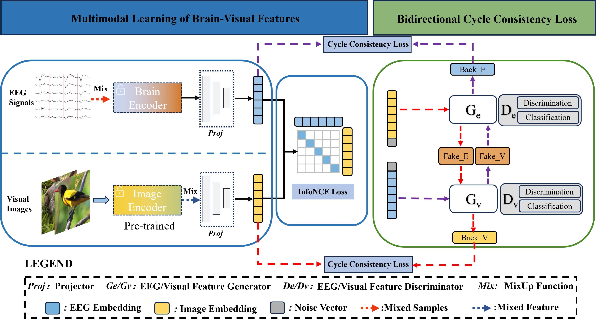
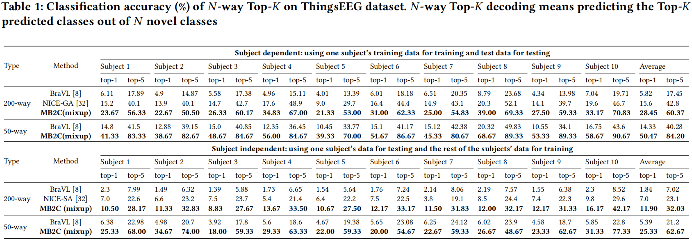
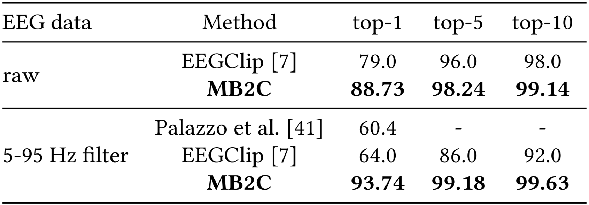
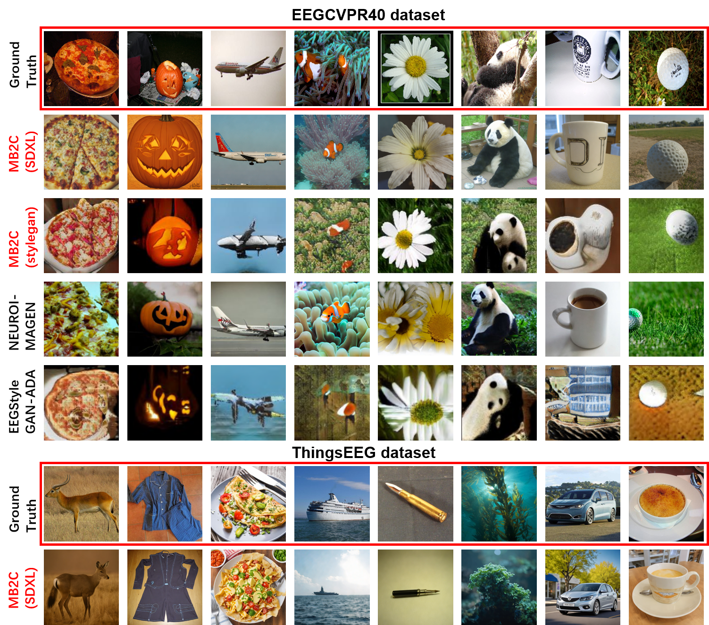

<!-- #region -->
# MB2C: Multimodal Bidirectional Cycle Consistency for Learning Robust Visual Neural Representations


[[Paper 🚀🚀🚀](https://dl.acm.org/doi/10.1145/3664647.3681292)] 
> - Authors: Yayun Wei*, Lei Cao†, Hao Li*, Yilin Dong
> *: Equally Contributed †: Corresponding Author
This repository hosts the official PyTorch implementation and pretrained model weights for our paper, "**MB2C: Multimodal Bidirectional Cycle Consistency for Learning Robust Visual Neural Representations,**" which has been accepted for publication in the Conference **ACM MM 2024(Poster). 




Our research focuses on decoding human visual representations from brain activity data. We trained our proposed method on (<a href="https://www.sciencedirect.com/science/article/pii/S1053811922008758?via%3Dihub/">ThinsEEG</a>) and  (<a href="http://braintumorsegmentation.org/">EEGCVPR40</a>). We perform zero-shot tasks on the ThingsEEG dataset. Additionally, we conduct EEG classification and image reconstruction on both the ThingsEEG and EEGCVPR40 datasets.
Please feel free to use them for further research, and if you use our code or pretrained weights, kindly cite our paper.

## Prepare for datasets:
1. The link of EEGCVPR40 [raw](https://iitgnacin-my.sharepoint.com/:u:/g/personal/19210048_iitgn_ac_in/EUmqfZISXTtQ-l0B8-UJNMMB0rTeUwY2T99388QAD1Tjow?e=ytjYvc)
2. The link of ThingsEEG [raw](https://osf.io/3jk45/)


```
## Download the required datasets ##
## preprocess ThingsEEG and EEGCVPR40 datasets ##
cd scripts
bash preprocess.sh
```

Data path for EEGCVPR40
- raw data: ./Data/CVPR40/Raw_data/
- proprocessed eeg data: ./Data/CVPR40/Preprocessed_5-95Hz/

Data path for ThingsEEG
- raw data: ./Data/Things-EEG2/Raw_data/
- proprocessed eeg data: ./Data/Things-EEG2/Preprocessed_data_250Hz/

**Please note that the raw (image and EEG) data are not included in this repo due to their size. The raw ImageNet images and brain EEG data can be downloaded from the corresponding official sources.**

## 🛠️ Config 
```
# create a conda environment
conda create -n mb2c python=3.8 -y
conda activate mb2c

# install pytorch
conda install pytorch==1.11.0 torchvision==0.12.0 torchaudio==0.11.0 cudatoolkit=11.3 -c pytorch

# install CLIP
pip install ftfy regex tqdm
pip install git+https://github.com/openai/CLIP.git

# install other dependencies
pip install diffuser==0.24.0
pip install transformer==4.28.0
if you can't download these 2 packages directly, you can download the source code and install them manually using the following commands:
python setup.py install
```

## 🎓 Training 
### For classification tasks
- zero-shot classification (**Subject dependent**)
- zero-shot classification (**Subject independent i.e. leave one subjuct out**)
- classification with targets on **EEGCVPR40 Dataset**
```
cd scripts
bash train.sh  
```
### 🎨 For image reconstruction tasks
On EEGCVPR40 dataset
- MB2C-Stylegan
Here, you can refer the paper  [EEGStyleGAN-ADA](https://github.com/prajwalsingh/eegstylegan-ada) for more details. Just replace the EEG-encoder with our EEG-encoder(MB2C).
```
cd image_reconstruction/MB2C_Stylegan
bash run.sh  # train a stylegan from scratch
bash metriccompute.sh  # calcualte the metrics
```
- MB2C-SDXL
```
cd image_reconstruction/MB2C_SDXL
bash run.sh
```
On ThingsEEG dataset
- MB2C-SDXL
**Download the pre-trained SDXL-turbo first from [huggingface link](https://huggingface.co/stabilityai/sdxl-turbo)**
```
cd image_reconstruction/MB2C_SDXL
bash run.sh
```


## 📋 ToDo List

Here's our ongoing task list:

- [x] Main model code release
- [x] Code about classification task released
- [x] Code about reconstruction task released
- [ ] More powerful generative model can combine with MB2C


## 💡 Acknowledgements

Gratitude to these foundational repositories:
1. [NICE-EEG](https://github.com/eeyhsong/NICE-EEG?tab=readme-ov-file)
2. [BraVL](https://github.com/ChangdeDu/BraVL)
3. [EEGStyleGAN-ADA](https://github.com/prajwalsingh/eegstylegan-ada)
4. [SDXL](https://arxiv.org/abs/2307.01952)

Many thanks to the authors of these datasets for their great works.
1. [EEGCVPR40](https://iitgnacin-my.sharepoint.com/:u:/g/personal/19210048_iitgn_ac_in/EUmqfZISXTtQ-l0B8-UJNMMB0rTeUwY2T99388QAD1Tjow?e=ytjYvc)
2. [ThingsEEG](https://www.sciencedirect.com/science/article/pii/S1053811922008758?via=ihub)

## 📞 Contact

If you have any questions, please contact us via email: leehao0517@163.com or weiyayun1660@163.com


## 📜 Citation

If our work assists your research, kindly cite us:
```
@inproceedings{wei2024mb2c,
  title={MB2C: Multimodal Bidirectional Cycle Consistency for Learning Robust Visual Neural Representations},
  author={Wei, Yayun and Cao, Lei and Li, Hao and Dong, Yilin},
  booktitle={Proceedings of the 32nd ACM International Conference on Multimedia},
  pages={8992--9000},
  year={2024}
}
```
